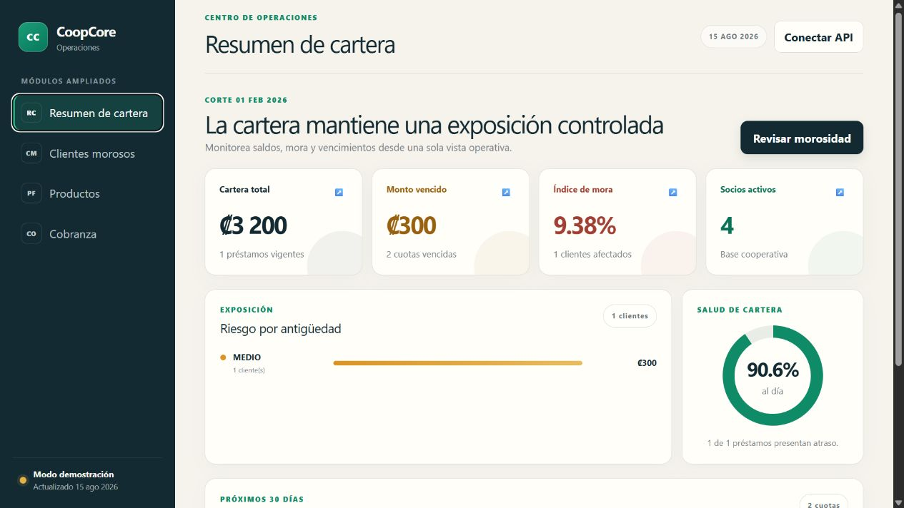
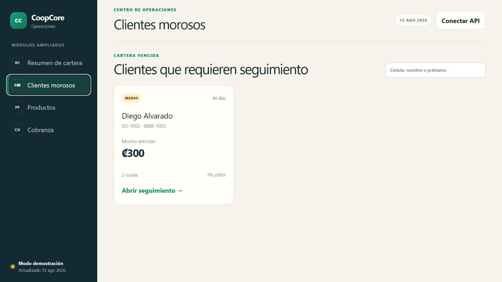
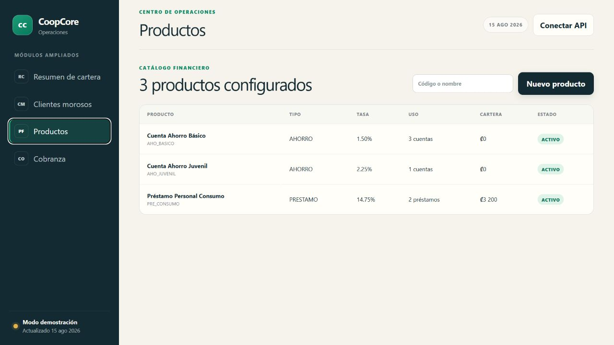
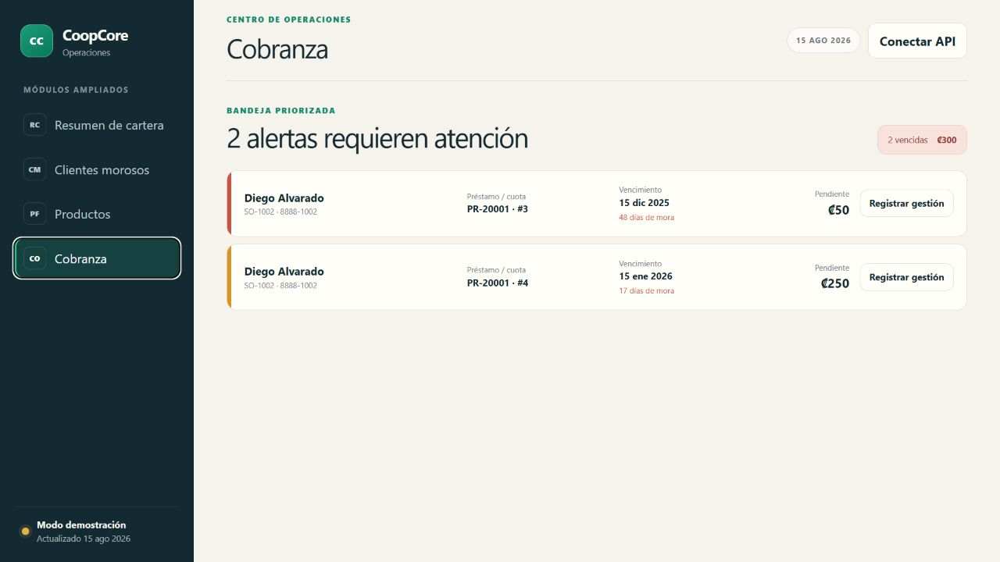

# CoopCore

Proyecto academico para **BTI23 Bases de Datos II**.

CoopCore modela operaciones de una cooperativa de ahorro y credito usando
**SQL Server** como pieza central del sistema.

## Principio de arquitectura

La base de datos ejecuta la logica de negocio por medio de procedimientos
almacenados. La API mantiene un rol delgado: solicitar operaciones a la BD.

## Estructura del repositorio

- `sql/`: scripts T-SQL por fases.
- `docs/`: documentacion tecnica y evidencias.
- `api/`: capa delgada HTTP; la implementacion vigente esta en
  `api/coopcore-api` con .NET 10.
- `frontend/`: centro de operaciones web para cartera, morosidad, productos y cobranza.

## Orden sugerido de ejecucion de scripts

1. `sql/00_create_database.sql`
2. `sql/01_schema_tables.sql`
3. `sql/02_seed_data.sql`
4. `sql/03_functions.sql` (funciones de mora y cuotas vencidas)
5. `sql/03_views.sql`
6. `sql/04_stored_procedures.sql`
7. `sql/05_transactions.sql`
8. `sql/06_security.sql`
9. `sql/07_security_tests.sql`
10. `sql/08_concurrency_tests.sql` (fase posterior del curso)
11. `sql/09_execution_plan_baseline.sql` (analisis antes de optimizar)
12. `sql/09_indexes_optimization.sql` (optimizacion despues de la linea base)
13. `sql/10_revision3_tests.sql` (pruebas de transacciones Revision 3)
14. `sql/11_busqueda_clientes_morosos.sql` (ampliacion de cartera vencida)
15. `sql/12_busqueda_clientes_morosos_tests.sql` (pruebas del buscador)
16. `sql/13_dashboard_cartera.sql` (indicadores y vencimientos de cartera)
17. `sql/14_productos_financieros.sql` (catalogo administrable de productos)
18. `sql/15_alertas_cobranza.sql` (alertas y seguimiento de cobro)
19. `sql/16_ampliacion_50_tests.sql` (pruebas integrales de la ampliacion)
20. `sql/17_entrega_final_tests.sql` (funciones y parametros OUTPUT)

## Cumplimiento SQL de entrega final

- `coop.fn_CalcularMoraCuota` centraliza el calculo de mora estimada y se usa
  desde `coop.sp_ConsultarAlertasCobranza`.
- `coop.fn_ObtenerCuotasVencidas` devuelve una tabla reutilizable y se usa
  desde `coop.sp_BuscarClientesMorosos` y
  `coop.sp_ConsultarDashboardCartera`.
- `coop.sp_RegistrarDeposito`, `coop.sp_RegistrarTransferencia` y
  `coop.sp_SolicitarPrestamo` exponen parametros `OUTPUT` opcionales sin romper
  los result sets consumidos por la API.
- Los 24 stored procedures incluyen autor, fecha y `SET NOCOUNT ON`.

## Manual tecnico final

El entregable consolidado esta en
[`docs/CoopCore_Manual_Tecnico.pdf`](docs/CoopCore_Manual_Tecnico.pdf). Tiene
38 paginas verificadas e incluye arquitectura, diagrama ER, diccionario de las
10 tablas, funciones, stored procedures, transacciones, seguridad, comparacion
de planes, API, instalacion, pruebas y guia de defensa. Se regenera con:

```powershell
python .\scripts\generate-technical-manual.py
```

## Nota sobre credenciales

Las contrasenas usadas en scripts de seguridad son solo de laboratorio.
No usar ni subir credenciales reales.

## Nota sobre capas

La API esta implementada como capa delgada y no reemplaza la logica en base de
datos. El frontend consume esos contratos y tambien funciona con datos de
demostracion para facilitar presentaciones sin una conexion activa.

## Ampliacion funcional del 50% - 15 de agosto de 2026

La linea base tenia seis modulos funcionales: autenticacion, socios, cuentas,
prestamos, morosidad y auditoria. Esta entrega agrega tres modulos completos,
por lo que el alcance pasa de **6 a 9 modulos (50% de crecimiento)**:

1. Dashboard de cartera con indicadores, riesgo y proximos vencimientos.
2. Gestion de productos financieros con consulta, creacion y actualizacion.
3. Alertas de cobranza con priorizacion y registro de gestiones.

Cada modulo incluye stored procedures, permisos, API .NET, interfaz web,
pruebas SQL y documentacion. El detalle reproducible esta en
`docs/ampliacion_funcional_50.md`.

### Vista de los modulos ampliados

| Dashboard de cartera | Clientes morosos |
|---|---|
|  |  |

| Productos financieros | Cobranza |
|---|---|
|  |  |

La interfaz es responsive, funciona con datos de demostracion y permite
conectarse a la API mediante un JWT para consultar datos reales.

## Validacion de sistema completo

El checklist para demostrar base de datos, seguridad, transacciones y API
funcionando de extremo a extremo esta en
`docs/evidencias/sistema_completo_smoke_test.md`.

El analisis de planes de ejecucion antes de optimizar esta documentado en
`docs/analisis_planes_ejecucion.md` y se apoya en
`sql/09_execution_plan_baseline.sql`.

Las optimizaciones justificadas por esa linea base estan en
`sql/09_indexes_optimization.sql` y se explican en
`docs/optimizacion_indices.md`.

## Revision 3 - Stored Procedures y transacciones

### Estado de stored procedures

| Metrica | Valor |
|---|---|
| Stored procedures requeridos por la linea base | 18 SPs |
| Minimo requerido (80%) | 15 SPs |
| Total real actual | **24 SPs** |
| Implementados completamente | **24 SPs (100%)** |
| Con transacciones explicitas | **10 SPs** |
| Marcadores de implementacion incompleta en `sql/05_transactions.sql` | **0** |

Calculo del 80%:

```text
18 * 0.80 = 14.4
Minimo requerido redondeado hacia arriba = 15 SPs completos
Resultado actual = 24/24 SPs completos
```

### SPs funcionales (24)

En `sql/04_stored_procedures.sql`:

| # | SP | Categoria |
|---:|---|---|
| 1 | `coop.sp_ValidarLogin` | Autenticacion |
| 2 | `coop.sp_ObtenerUsuarioPorCredenciales` | Autenticacion |
| 3 | `coop.sp_CambiarPassword` | Autenticacion |
| 4 | `coop.sp_ConsultarSocio` | Consulta |
| 5 | `coop.sp_ConsultarSaldo` | Consulta |
| 6 | `coop.sp_ConsultarMovimientos` | Consulta |
| 7 | `coop.sp_RegistrarSocio` | Gestion |
| 8 | `coop.sp_CrearCuenta` | Gestion |
| 9 | `coop.sp_ConsultarPrestamo` | Consulta |
| 10 | `coop.sp_ConsultarAuditoria` | Consulta |

En `sql/05_transactions.sql`:

| # | SP | Categoria |
|---:|---|---|
| 11 | `coop.sp_RegistrarDeposito` | Cuentas, transaccional |
| 12 | `coop.sp_RegistrarRetiro` | Cuentas, transaccional |
| 13 | `coop.sp_RegistrarTransferencia` | Cuentas, transaccional |
| 14 | `coop.sp_PagarCuota` | Prestamos, transaccional |
| 15 | `coop.sp_SolicitarPrestamo` | Prestamos, transaccional |
| 16 | `coop.sp_AprobarPrestamo` | Prestamos, transaccional |
| 17 | `coop.sp_RechazarPrestamo` | Prestamos, transaccional |
| 18 | `coop.sp_GenerarAmortizacion` | Prestamos, transaccional |
| 19 | `coop.sp_BuscarClientesMorosos` | Morosidad |
| 20 | `coop.sp_ConsultarDashboardCartera` | Cartera |
| 21 | `coop.sp_BuscarProductosFinancieros` | Productos |
| 22 | `coop.sp_GuardarProductoFinanciero` | Productos, transaccional |
| 23 | `coop.sp_ConsultarAlertasCobranza` | Cobranza |
| 24 | `coop.sp_RegistrarGestionCobranza` | Cobranza, transaccional |

Los SPs transaccionales usan `BEGIN TRY`, `SET XACT_ABORT ON`,
`BEGIN TRANSACTION`, `COMMIT TRANSACTION`, `BEGIN CATCH`, `ROLLBACK
TRANSACTION` cuando `@@TRANCOUNT > 0` y `THROW` para errores controlados.
Tambien registran auditoria y, cuando aplica, movimientos en `coop.Movimiento`.

### Pruebas de Revision 3

`sql/10_revision3_tests.sql` incluye pruebas para:

- Deposito.
- Retiro.
- Transferencia.
- Solicitud de prestamo.
- Aprobacion de prestamo.
- Generacion de amortizacion.
- Pago de cuota.
- Rechazo de prestamo usando una solicitud separada.

Ejemplo de ejecucion manual:

```sql
EXEC coop.sp_RegistrarDeposito
    @NumeroCuenta = N'CTA-10001',
    @Monto = 25.00,
    @CedulaEmpleado = N'EM-0101',
    @Observacion = N'Prueba manual Revision 3';
```

Los permisos de `sql/06_security.sql` ya conceden ejecucion de los SPs
transaccionales a los roles internos correspondientes.

## API oficial en .NET 10

La API vigente esta en `api/coopcore-api` y usa
**.NET 10 + ASP.NET Core Web API**. Mantiene una arquitectura por capas:

`Controllers -> Interfaces -> Services -> Db`

La API se conecta como `coop_api_login`, no como `sa`, y ejecuta stored
procedures reales mediante ADO.NET con `Microsoft.Data.SqlClient`.

Endpoints implementados:

- `POST /api/auth/login` -> `coop.sp_ValidarLogin`
- `POST /api/auth/cambiar-password` -> `coop.sp_CambiarPassword`
- `GET /api/socios/{id}` -> `coop.sp_ConsultarSocio`
- `POST /api/socios` -> `coop.sp_RegistrarSocio`
- `POST /api/cuentas` -> `coop.sp_CrearCuenta`
- `GET /api/cuentas/{numeroCuenta}/saldo` -> `coop.sp_ConsultarSaldo`
- `GET /api/cuentas/{numeroCuenta}/movimientos` -> `coop.sp_ConsultarMovimientos`
- `POST /api/cuentas/depositos` -> `coop.sp_RegistrarDeposito`
- `POST /api/cuentas/retiros` -> `coop.sp_RegistrarRetiro`
- `POST /api/cuentas/transferencias` -> `coop.sp_RegistrarTransferencia`
- `GET /api/prestamos/{numeroPrestamo}` -> `coop.sp_ConsultarPrestamo`
- `GET /api/clientes-morosos` -> `coop.sp_BuscarClientesMorosos`
- `GET /api/cartera/dashboard` -> `coop.sp_ConsultarDashboardCartera`
- `GET /api/productos-financieros` -> `coop.sp_BuscarProductosFinancieros`
- `POST|PUT /api/productos-financieros` -> `coop.sp_GuardarProductoFinanciero`
- `GET /api/cobranza/alertas` -> `coop.sp_ConsultarAlertasCobranza`
- `POST /api/cobranza/gestiones` -> `coop.sp_RegistrarGestionCobranza`
- `POST /api/prestamos` -> `coop.sp_SolicitarPrestamo`
- `POST /api/prestamos/{numeroPrestamo}/aprobar` -> `coop.sp_AprobarPrestamo`
- `POST /api/prestamos/{numeroPrestamo}/rechazar` -> `coop.sp_RechazarPrestamo`
- `POST /api/prestamos/{numeroPrestamo}/amortizacion` -> `coop.sp_GenerarAmortizacion`
- `POST /api/prestamos/{numeroPrestamo}/cuotas/{numeroCuota}/pagos` -> `coop.sp_PagarCuota`
- `GET /api/auditoria` -> `coop.sp_ConsultarAuditoria`

Tambien ofrece `GET /api/health` como healthcheck, sin acceso a datos.

Con la API en ejecucion, Swagger UI queda disponible en
`http://localhost:5000/swagger` y el contrato OpenAPI en
`http://localhost:5000/swagger/v1/swagger.json`.

El login devuelve un JWT en `datos.token`. Los endpoints de socios/cuentas,
prestamos y auditoria requieren `Authorization: Bearer <TOKEN>` y validan los
roles `ADMIN_APP`, `CAJERO_APP`, `OFICIAL_CREDITO_APP` y `AUDITOR_APP`.

La configuracion y los ejemplos de uso estan en `api/coopcore-api/README.md`.

La API Node.js/Express creada en el segundo avance fue un antecedente historico
del proyecto. La implementacion vigente no usa Node.js, `package.json` ni
`api/src`; queda una sola API oficial en .NET.

### Objetivo

Crear una primera API academica para CoopCore usando .NET 10, sin mover la
logica de negocio desde SQL Server hacia C#. La API recibe solicitudes HTTP,
valida datos minimos, llama stored procedures y devuelve respuestas JSON.

### Modulos implementados

| Modulo | Controller | Service | Stored procedures |
|---|---|---|---|
| Auth | `AuthController` | `AuthService` | `coop.sp_ValidarLogin`, `coop.sp_CambiarPassword` |
| Socios | `SociosController` | `SocioService` | `coop.sp_ConsultarSocio`, `coop.sp_RegistrarSocio` |
| Cuentas | `CuentasController` | `CuentaService` | `coop.sp_CrearCuenta`, `coop.sp_ConsultarSaldo`, `coop.sp_ConsultarMovimientos`, `coop.sp_RegistrarDeposito`, `coop.sp_RegistrarRetiro`, `coop.sp_RegistrarTransferencia` |
| Prestamos | `PrestamosController` | `PrestamoService` | `coop.sp_ConsultarPrestamo`, `coop.sp_SolicitarPrestamo`, `coop.sp_AprobarPrestamo`, `coop.sp_RechazarPrestamo`, `coop.sp_GenerarAmortizacion`, `coop.sp_PagarCuota` |
| Morosidad | `ClientesMorososController` | `MorosidadService` | `coop.sp_BuscarClientesMorosos` |
| Cartera | `CarteraController` | `CarteraService` | `coop.sp_ConsultarDashboardCartera` |
| Productos financieros | `ProductosFinancierosController` | `ProductoFinancieroService` | `coop.sp_BuscarProductosFinancieros`, `coop.sp_GuardarProductoFinanciero` |
| Cobranza | `CobranzaController` | `CobranzaService` | `coop.sp_ConsultarAlertasCobranza`, `coop.sp_RegistrarGestionCobranza` |
| Auditoria | `AuditoriaController` | `AuditoriaService` | `coop.sp_ConsultarAuditoria` |

### Ejecutar la API

```powershell
Copy-Item api\coopcore-api\coopcore-api\appsettings.example.json api\coopcore-api\coopcore-api\appsettings.Development.json
dotnet restore api\coopcore-api\coopcore-api\coopcore-api.csproj
dotnet build api\coopcore-api\coopcore-api\coopcore-api.csproj
dotnet run --project api\coopcore-api\coopcore-api\coopcore-api.csproj --urls http://localhost:5000
```

Antes de probar endpoints de datos, ajustar
`ConnectionStrings:CoopCoreDb` en `appsettings.Development.json`.

### Probar endpoints

```powershell
curl.exe http://localhost:5000/api/health

curl.exe -X POST http://localhost:5000/api/auth/login `
  -H "Content-Type: application/json" `
  -d '{"usuario":"mlrojas","password":"Lab_Cajero_001"}'

$token = "<TOKEN_DEVUELTO_EN_DATOS_TOKEN>"

curl.exe http://localhost:5000/api/socios/SO-1001 `
  -H "Authorization: Bearer $token"

curl.exe http://localhost:5000/api/cuentas/CTA-10001/saldo `
  -H "Authorization: Bearer $token"

curl.exe http://localhost:5000/api/cuentas/CTA-10001/movimientos `
  -H "Authorization: Bearer $token"

curl.exe http://localhost:5000/api/prestamos/PR-20001 `
  -H "Authorization: Bearer $token"
```
